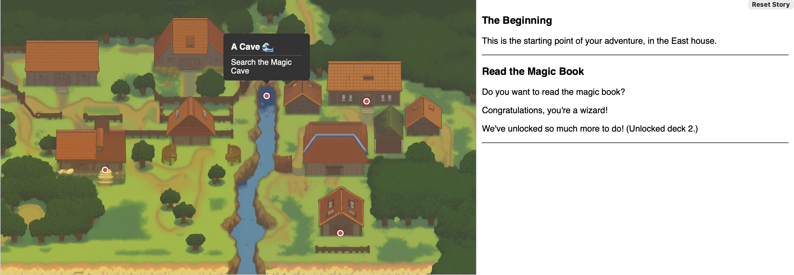

# Ink-Storylet-JS
 Javascript test harness for Ink storylets.

**TL;DR — a simple Storylet implementation for Ink in Javascript.**

See my Medium post - [over here](https://wildwinter.medium.com/storylets-explained-ff5a24842bd9) - for a longer explanation of Storylets.

A quick summary:
* Storylets are individual chunks of story that have a **condition** attached to them saying “am I available for the player to play now?” A useful way to think about them is like a deck of cards, and the currently playable storylets as a hand of cards.
* After each storylet is played, you recalculate your new hand of cards, because the storylet you just played might have affected the game state, and so might affect the condition for each storylet.

## Storylet Format

My Ink implementation of storylets is very lean and looks something like this:

```ink
=== function _story_1() ===
~ return true

=== story_1 ===
This is story 1.
~ some_variable = true
-> END

=== function _story_2() ===
// This will only be available if some_variable is set!
~ return some_variable

=== story_2 ===
Hey, this is story 2.
-> END
```

### Basics
* Each storylet (e.g. `story_1`, `story_2`) has a **condition** function above it next to it, which determines if that storylet can be played or not. It’s just the name of the storylet with an underscore in front of it.
If there is no function, it’s assumed to be true.

* If a storylet has been used up, it’s not available again. i.e. that card has been played.

### Repeating Storylets
If a storylet has been used up, by default it’s not available again. 
However, if you set the tag `#st-repeat` to true, it will always attempt to repeat (but may not show if the condition function is false).

```ink
=== function _story_2() ===
// This will only be available if some_variable is set!
~ return some_variable

=== story_2 ===
#st-repeat: true
Hey, this is story 2.
-> END
```

### Decks
Storylets are divided into **decks**. Different decks just have different prefixes. For convenience, I put them in different Ink files.

*deck1.ink:*
```ink 
// No condition function means it defaults to true
=== deck1_intro ===
Hey, this is an intro storylet.
-> END

=== function _deck1_somethingorother() ===
~ return true
=== deck1_somethingorother ===
Hi, this is a storylet.
-> END
```

*deck2.ink:*
```ink
=== deck2_intro ===
Hey, this is an intro storylet for deck2.
-> END

=== deck2_somethingorother ===
Hi, this is a storylet in deck 2.
-> END
```

#### Adding a deck
For this test harness, to add them I call the Ink/JS function to add the deck at the top of each file - but you can do it wherever you want to.

*deck1.ink:*
```ink
~ add_deck("deck1")

// No condition function means it defaults to true
=== deck1_intro ===
Hey, this is an intro storylet.
-> END

=== function _deck1_somethingorother() ===
~ return true
=== deck1_somethingorother ===
Hi, this is a storylet.
-> END
```

*deck2.ink:*
```ink
~ add_deck("deck2")

=== deck2_intro ===
Hey, this is an intro storylet for deck2.
-> END

=== deck2_somethingorother ===
Hi, this is a storylet in deck 2.
-> END
```

#### Deck-level Condition Function
You can also add a condition function *that applies to the whole deck*, like so:

*deck1.ink:*
```ink
~ add_deck("deck1")

=== function _deck1() ===
// return true only if you are a priest
~ return is_class_priest;

// No condition function means it defaults to true
=== deck1_intro ===
Hey, this is an intro storylet.
-> END

=== function _deck1_somethingorother() ===
~ return true
=== deck1_somethingorother ===
Hi, this is a storylet.
-> END
```

*deck2.ink:*
```ink
~ add_deck("deck2")

=== function _deck2() ===
// return true only if you are not a wizard
~ return not is_class_wizard;

=== deck2_intro ===
Hey, this is an intro storylet for deck2.
-> END

=== deck2_somethingorother ===
Hi, this is a storylet in deck 2.
-> END
```

These deck condition functions are tested before everything else e.g. if a deck function is false, none of the storylets in that deck are tested. This is useful for whole swathes of content that depend on major player choices or skills or progression variables.

If there is no deck function, it is assumed to be true.

## Plain-Test: Simple Javascript Test Harness
Take a look at the code for `apps/plain-test` in the repo — there’s a very lightweight Javascript implementation. 

The main ink file is in `content/app.ink` — that’s the thing to open in Inky, then export to `built-content/app.js`.

The storylets source code are stored in the folder `content/storylets`. That’s where you’ll see the different decks — the filenames are arbitrary and are included in `content/storylets/storylets.ink`.

You’ll need to run plain-test via a local web server as a web browser won’t work with local file access. Google “start a local web server for testing” if you’re not sure how to do that.

The file you want to run is `apps/plain-test/web/index.html`

This is all very very basic. But will let you write sets of storylets, the logic that connects them, and see how they play together.

### Under The Hood
The file `engine/storylets.js` does the bulk of the work and may be useful to you in other things.

The core class is `Storylets`. You create an instance by passing it a parsed Ink story, like so:

```javascript
// Load Ink story.
var story = new inkjs.Story(storyContent);

// Set up Storylets
var storylets = new Storylets(story);
That initialises the Ink, finds all the relevant decks etc. Here are some useful snippets:
// Do this when the storylet availability check is completed
storylets.onUpdated = myCustomStoryletsReadyFunction;

// Recalculates which storylets are currently available. This
// works across several frames, instead of choking everything.
// Once done, it will call back via storylets.onUpdated, above...
storylets.StartUpdate(); 
```

Then once the update is complete:
```javascript
// Once an update has finished, this returns a list of 
// storylet names as strings, which you can then choose between...
var storyletNames = storylets.GetAvailable()

// Then you can tell the storylet engine to pick one. This moves
// Ink to this path and starts executing..
storylets.ChooseStorylet(storyletName);
```

Then run Ink normally via `story.Continue()` until you run out of content or make choices or whatever you want to do… and once you’ve run out of Ink, call `StartUpdate()` and get a new list of available storylets.

## Map-Test: Map-Based Javascript Test Harness



Take a look at the code for `apps/map-test` in the repo — this is a lightweight Javascript implementation of a 'world map'. Each storylet has a `#loc` tag which specifies which location on the map it's associated with. The locations are set up in `web\main.js`:

```javascript
MapSymbolManager.addSymbol({left: "40%", top: "25%", id: "town_hall", title: "Town Hall 🏛️", description: "The civic heart of the town. Built in 1898."});

MapSymbolManager.addSymbol({left: "77%", top: "37%", id: "library", title: "The Library 📚", description: "Historic records and modern media center."});

MapSymbolManager.addSymbol({left: "71.5%", top: "85%", id: "east", title: "East House 🏠", description: "House belonging to the East family."});

MapSymbolManager.addSymbol({left: "22%", top: "62%", id: "bar", title: "Frog & Horses 🍺", description: "Local bar and club."});

MapSymbolManager.addSymbol({left: "56%", top: "35%", id: "cave", title: "A Cave 🌊", description: "Cave which the river disappears into."});
```

Otherwise it works exactly as the `plain-test` version does. Hopefully this gives you some idea how you could use storylets for an implementation of explorable story in a world.